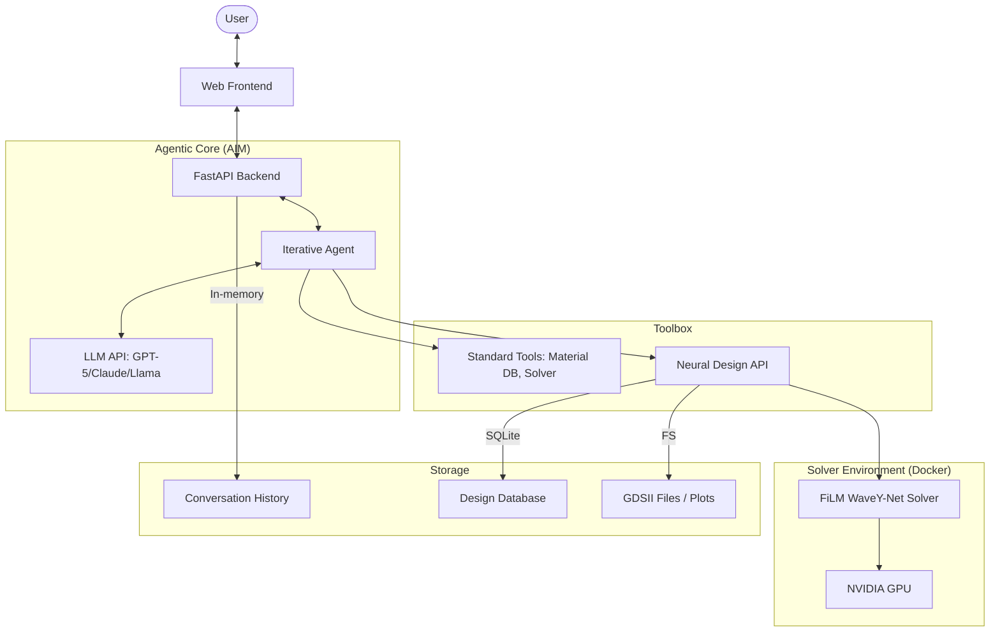

# MetaChat Architectural Map

## 1. System Components Overview

| Component | Responsibility | Key Technologies |
| :--- | :--- | :--- |
| **User Interface** | Web-based chat & visualization | HTML, CSS, JS, MathJax |
| **Web Server** | API gateway, session management, tool hosting | FastAPI, Uvicorn, SSE |
| **AIM Agent Stack** | High-level reasoning, CoT iterative monologue | Python, OpenAI/Anthropic/Llama APIs |
| **Scientific Tools** | Material DB, symbolic & numeric solvers | SQLite, SymPy, NumPy |
| **Neural Design API** | Bridge between agent and surrogate solvers | Python, Docker, ast |
| **FiLM WaveY-Net** | Fast fullwave surrogate electromagnetic solver | PyTorch, UNet, FiLM |
| **Hardware Layer** | Computational resources | NVIDIA GPUs (CUDA) |

## 2. Structural Relationship

## 3. Communication Patterns
- **User <-> Backend:** Asynchronous JSON requests for initial contact; Server-Sent Events (SSE) for streaming the agent's monologue and final design results.
- **Agent <-> LLM:** Stateless REST API calls (OpenAI/Anthropic). Context is maintained by the Agent in the backend.
- **Agent <-> Tools:** Synchronous Python method calls (Standard Tools).
- **Backend <-> Solver:** Asynchronous Docker container execution. Communication via mounted volumes (`/media`) for large file exchange and temporary result directories.

## 4. Key Design Patterns
- **Agentic Iterative Monologue:** An internal loop where the agent updates its own state until a threshold is met.
- **Conditional Neural Inference:** Feature-wise Linear Modulation (FiLM) used to adapt a static UNet to variable physical conditions (angle, wavelength).
- **Monorepo:** Shared codebases for agents and tools across different sub-projects (`metachat-aim` vs `web-app`).
